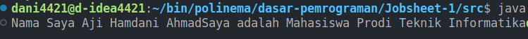
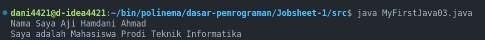
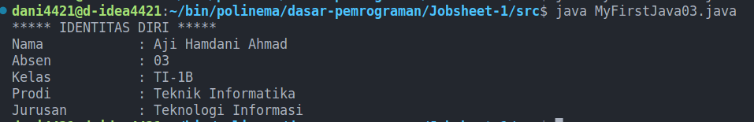

<h1 style="text-align: center;">Jobsheet 1</h1>

## Identitas Mahasiswa

> Nama : Aji Hamdani Ahmad <br/>
> Kelas : 1B <br/>
> Prodi : D-IV Teknik Informatika <br/>
> Jurusan : Teknologi Informasi <br/>

## 1. Tujuan Praktikum

- Mahasiswa mengenal konsep program dan bahasa pemrograman
- Mahasiswa mampu melakukan instalasi tools pemrograman Java
- Mahasiswa memahami struktur dasar Java
- Mahasiswa mampu melakukan compile dan debugging

## 2. Praktikum

### 2.1 Percobaan 1: Melakukan instalasi Java Development Kit/JDK

1. Download Java Development Kit:
   - [Oracle.com](https://www.oracle.com/java/technologies/downloads/)
   - [Java.com](https://www.java.com/en/download/)
1. Install Executing File Java Development Kit
1. Langkah selanjutnya adalah setting PATH (khusus untuk sistem operasi Windows),
   sehingga perintah java dapat dikenali.
1. Cara melakukan setting PATH adalah buka Control Panel-> System-> Advanced
   System Setting-> Environment Variabel. Kemudian cari variabel PATH, jika belum ada
   maka buatlah variabel PATH tersebut.
1. Langkah selanjutnya adalah mengisi variabel PATH, jika varibel PATH sudah ada isinya
   jangan menghapus nilai yang sudah ada tetapi tambahkan C:\Program
   Files\Java\jdk\bin ( sebagai pemisah antar nilai gunakan karakter ;).
   NB: Lokasi nilai JDK yang ditambahkan sesuaikan folder dimana Java terinstal, pada
   contoh diatas JDK tersintal di C:\Program Files.
1. Buka Command Prompt (Wind+R, kemudian ketik cmd), selanjutnya ketikan perintah
   javac , jika perintah tersebut dikenali maka lingkungan operasi Windows telah
   mendukung program java, tetapi jika belum dikenali lakukan pengecekan pada setting
   PATH (dimungkinkan ada kesalahan ketika memasukkan lokasi direktori bin di variabel
   PATH).

### Pertanyaan:

1. Jelaskan apa kegunaan memasukkan lokasi folder bin dari java ke dalam variable **PATH**
2. Jelaskan kegunaan perintah javac ketika masuk di command prompt

### Jawaban:

1. - Akses global untuk perintah **Java** seperti **java**, **javac**
   - Sederhana dan efisien untuk akses perintah Java tidak perlu untuk menuliskan jalur lengkap dari directory instalasi
2. Perintah **javac** digunakan untuk melakukan kompilasi, Dan pada Command Prompt

### 2.2 Percobaan 2: Struktur Dasar Java

1.  Lakukan instalasi kode editor seperti VS Code, Sublime, Atom atau IDE seperti Netbeans, Intellij IDE.
2.  Buka kode editor dan buat file baru dan simpan dengan nama **MyFirstJava<span style="color: red;">NoAbsen</span>.java**
3.  Tuliskan kode program berikut: (kode program berikut merupakan struktur dasar
    java). Gantilah 00 dengan no absen Anda.

    ```java
    public class MyFirstJava03 {
        public static void main(String[] args) {

        }
    }
    ```

    - public adalah sebuah keyword di Java yang menandakan bahwa objek, method, atau atribut dapat diakses dari class lain.
    - class adalah sebuah keyword di Java yang digunakan untuk membuat sebuah class
    - static adalah sebuah keyword untuk membuat sebuah method tidak perlu diinstansiasi
      terlebih dahulu
    - void adalah sebuah keyword untuk membuat sebuah method tidak me-return nilai
      apapun atau kosong
    - Nama class dan nama file harus sama

4.  Simpan Kode tersebut
5.  Buka terminal dan masuk pada lokasi folder **MyFirstJava00.java** tersimpan. Untuk pindah ke direktori, maka dapat menggunakan perintah
    cd. Misalnya file Latihan.java tersimpan pada
    > “C:\Users\MamluatulHani'ah\Documents\POLINEMA\Ganjil 2020-2021\Pertemuan 1”
6.  Setelah anda sudah masuk di folder tempat menyimpan file MyFirstJava00.java, maka
    langkah selanjutnya adalah melakukan compile dengan mengetikkan perintah javac
    NamaFile.java (javac MyFirstJava00.java)

    ```shell
    javac MyFirstJava03.java
    ```

7.  Jika proses kompilasi berhasil dan tidak ada error maka akan terdapat file baru dengan
    nama MyFirstJava.class (buka dan cek di folder tempat anda menyimpan file
    MyFirstJava.java).
8.  Untuk menjalankan program yang telah dikompilasi, masukkan perintah java
    NamaClass (java MyFirstJava00)
    ```shell
    java MyFirstJava03.java
    ```
9.  Pada percobaan yang telah anda lakukan belum ada output yang ditampilkan di layar
    command prompt, karena kode program yang dituliskan hanya struktur dasar
    program java.
10. Lakukan modifikasi pada file MyFirstJava00.java dengan menambahkan kode berikut
    ini!

```java
public class MyFirstJava03 {
    public static void main(String[] args) {
        System.out.println('Nama Saya Aji Hamdani Ahmad');
    }
}
```

11. Simpan file tersebut (File->Save)
12. Lakukan compilasi seperti pada langkah ke 6.
13. Jika tidak ada error maka lakukan langkah 8.
14. Amatilah hasil output kode program tersebut! Apakah sama dengan gambar berikut
    > Nama Saya XXXX

### Pertanyaan

1. Jelaskan fungsi perintah javac MyFirstJava00.java pada percobaan diatas!
2. Jelaskan fungsi perintah java MyFirstJava00 pada percobaan diatas!
3. Tambahkan kode program System.out.println("Saya adalah Mahasiswa Program
   Studi Teknik Informatika"); pada baris ke 6, kemudian jalankan program tersebut dan
   Jelaskan bagaimana hasil outputnya!

4. Gantilah perintah System.out.println menjadi System.out.print pada baris ke 4 dan 5
   kemudian jalankan program!
5. Apakah perbedaan System.out.println(".........."); dan System.out.print("............");,
   Jelaskan!
6. Gantilah perintah pada baris ke 6 menjadi seperti berikut ini :
   ```java
   System.out.print("\nsaya adalah Mahasiswa Prodi Teknik Informatika");
   ```
7. Jelaskan fungsi perintah \n pada baris ke 6!
8. Pada baris ke 6 tambahkan karakter // sehingga baris tersebut menjadi
   ```java
   // System.out.print("\nsaya adalah Mahasiswa Prodi Teknik Informatika");
   ```
9. Jalankan program dan amati apakah yang terjadi!
10. Jelaskan fungsi karakter // pada baris ke 6!

### Jawaban

1. Fungsi dari perintah `javac MyFirstJava03.java` adalah untuk melakukan proses compiling pada file `MyFirstJava03.java` yang bertujuan agar kode program dapat dijalankan.
2. Fungsi dari perintah `java MyFirstJava03.java` yaitu untuk melakukan running pada file `MyFirstJava03.java` berdasarkan hasil compile yang sudah dilakukan sebelumnya.
3. ```java
    public class MyFirstJava03 {
        public static void main(String[] args) {
            System.out.println("Nama Saya XXXX");
            System.out.println("Saya adalah Mahasiswa Prodi Teknik Informatika");
        }
    }
   ```

   Hasil yang ditampilkan seharusnya hanya

   > Nama Saya XXX

   karena setiap terjadi perubahan harus dilakukan compile ulang sehingga file hasil compile yang akan dijalankan akan dapat terbaru.

4. ```java
   public class MyFirstJava03 {
       public static void main(String[] args) {
           System.out.print("Nama Saya XXXX");
           System.out.print("Saya adalah Mahasiswa Prodi Teknik Informatika");
       }
   }
   ```

   > Hasil Compile: 

5. `System.out.println` akan memberikan baris baru saat setelah berhasil menampilkan sedangkan `System.out.print` tidak menambahkan baris baru setelah menampilkan.

6. ```java
    public class MyFirstJava03 {
       public static void main(String[] args) {
           System.out.print("Nama Saya XXXX");
           System.out.print("/nSaya adalah Mahasiswa Prodi Teknik Informatika");
       }
   }
   ```
   > Hasil compile:
   > 
7. Pemberian `/n` merupakan format yang dapat digunakan pada String untuk `/n` sendiri akan memberikan baris baru ketika dijalankan jadi untuk program tersebut akan memberikan baris baru terlebih dahulu kemudian akan mencetak kalimat setelahnya `Saya adalah Mahasiswa Prodi Teknik Informatika`
8. ```java
    public class MyFirstJava03 {
       public static void main(String[] args) {
           System.out.print("Nama Saya XXXX");
           System.out.print("/nSaya adalah Mahasiswa Prodi Teknik Informatika");
       }
   }
   ```
9. Hasil Compile: `Nama Saya Aji Hamdani Ahmad`
10. Karakter tersebut adalah `comment` dimana ketika ada kode program setelah kode tersebut pada baris yang sama maka kode program tersebut tidak akan dijalankan atau dalam kata lain akan dihiraukan.

## 3.Tugas

Buatlah program java dengan hasil output sebagai berikut, kemudian jelaskan jalankan
program yang telah anda buat!

```java
public class MyFirstJava03 {
    public static void main(String[] args) {
        System.out.println("***** IDENTITAS DIRI *****");
        System.out.println("Nama\t\t: Aji Hamdani Ahmad");
        System.out.println("Absen\t\t: 03");
        System.out.println("Kelas\t\t: TI-1B");
        System.out.println("Prodi\t\t: Teknik Informatika");
        System.out.println("Jurusan\t\t: Teknologi Informasi");

    }
}

```

> Hasil Compile: 
