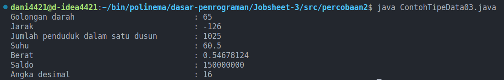
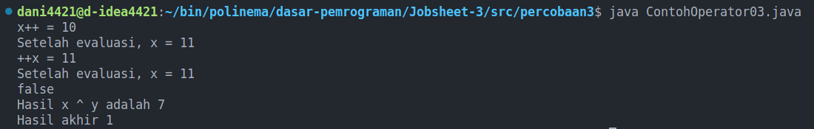
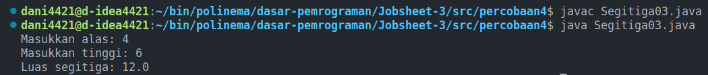
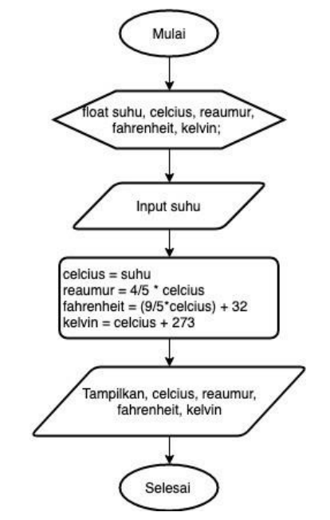

<div style="text-align: center;">
    <h1>Jobsheet 3</h1>
    <h4>Variabel, Tipe Data, Operator dan </h4>
</div>

## Identitas Mahasiswa

> Nama : Aji Hamdani Ahmad <br/>
> Kelas : 1B <br/>
> Prodi : D-IV Teknik Informatika <br/>
> Jurusan : Teknologi Informasi <br/>

## 1. Tujuan

- Mahasiswa dapat memahami dan mampu menjelaskan tentang Tipe Data ke
  pemrograman Java
- Mahasiswa dapat memahami dan mampu menjelaskan tentang Variabel pada
  pemrograman Java
- Mahasiswa dapat menerangkan dan mampu menjelaskan tentang Input-output
  ke pemrograman Java
- Mahasiswa dapat mengemukakan dan mampu menjelaskan tentang Sequence
  ke pemrograman Java
- Mahasiswa dapat memahami dan mampu menguraikan tentang Operator ke
  pemrograman Java

## 2. Praktikum

### 2.1 Percobaan 1: Penggunaan Variabel

1. Buka teks editor
1. Buat file baru, beri nama `ContohVariabel`<span style="color: red;">NoAbsen</span>`.java`
1. Tuliskan struktur dasar bahasa java yang berisi fungsi main().

   ```java
   public class ContohVariabel03 {
    public static void main(String[] args) {
        // kode program
    }
   }
   ```

1. Tuliskan kode di bawah ini pada public static void main(String args[])

```java
String salahSatuHobySayaAdalah = "Berhasil petak umpet";
boolean isPandai = true;
char jenisKelamin = 'L';
byte _umurSayaSekarang = 20;
double $ipk = 3.24, tinggi = 1.70;
System.out.println(salahSatuHobySayaAdalah);
System.out.println("Apakah pandai " + isPandai);
System.out.println("Jenis Kelamin " + jenisKelamin);
System.out.println("Umurku saat ini " + _umurSayaSekarang);
System.out.println(String.format("Saya beripk %s, dengan tinggi badan %s", $ipk, tinggi));
```

5. Jalankan kode program yang telah Anda buat kemudian amati hasilnya.

`Hasil compile`

```
Berhasil petak umpet
Apakah pandai true
Jenis Kelamin L
Umurku saat ini 20
Saya beripk 3.24, dengan tinggi badan 1.7
```

### Pertanyaan

1. Silakan Anda ubah nama variabel sehingga model penamaan variabel menjadi baik
   dan benar!
2. Untuk apakah %s pada statement dibawah ini?
   `System.out.println(String.format("Saya beripk %s, dengan tinggi badan %s", $ipk, tinggi));`<br/>
   Apakah ada yang bisa digunakan selain %s? Sebut dan jelaskan!

### Jawaban

1. ```java
   public class ContohVariabel03 {
     public static void main(String[] args) {
       String hobby = "Berhasil petak umpet";
       boolean isSmart = true;
       char gender = 'L';
       byte age = 20;
       double ipk = 3.24, height = 1.70;
       System.out.println(hobby);
       System.out.println("Apakah pandai " + isSmart);
       System.out.println("Jenis Kelamin " + gender);
       System.out.println("Umurku saat ini " + age);
       System.out.println(String.format("Saya beripk %s, dengan tinggi badan %s", ipk, height));
     }
   }
   ```
2. `%s` adalah sebuah String format yang digunakan untuk digantikan dengan argumen yang akan diberikan. Dan masih terdapat beberapa String format yang bisa digunakan selain `%s` saja antara lain: <br/>
   `%d`: Untuk menggantikan argument bertipe Integer <br/>
   `%f`: Untuk menggantikan argument bertipe float, double. dan bisa digunakan untuk menentukan tingkat ketelitiannya.

### 2.2 Percobaan 2: Penggunaan Tipe Data

1. Buka teks editor
2. Buat file baru, beri nama `ContohTipeData`<span style="color: red;">NoAbsen</span>`.java`
3. Tuliskan struktur dasar bahasa java yang berisi fungsi main().
   ```java
    public class ContohTipeData03 {
      public static void main(String[] args) {
        // kode program
      }
    }
   ```
4. Tuliskan kode di bawah ini pada public static void main(String args[])

   ```java
    char golonganDarah = 'A';
    byte jarak = (byte) 130;
    short jumlahPendudukDalamSatuDusun = 1025;
    float suhu = 60.50F;
    double berat = 0.5467812345;
    long saldo = 150000000;
    int angkaDesimal = 0x10;

    System.out.println("Golongan darah\t\t\t\t: " + (byte) golonganDarah);
    System.out.println("Jarak\t\t\t\t\t: " + jarak);
    System.out.println("Jumlah penduduk dalam satu dusun\t: "+ jumlahPendudukDalamSatuDusun);
    System.out.println("Suhu\t\t\t\t\t: " + suhu);
    System.out.println("Berat\t\t\t\t\t: " + (float) berat);
    System.out.println("Saldo\t\t\t\t\t: " + saldo);
    System.out.println("Angka desimal\t\t\t\t: " + angkaDesimal);
   ```

5. Jalankan kode program yang telah Anda buat kemudian amati hasilnya.
   

### Pertanyaan

1. Mengapa ketika menampilkan nilai hasilnya bukan A ?
2. Apa maksud sintak byte jarak = (byte) 130 ? kemudian mengapa ketika ditampilkan
   hasilnya berubah?
3. Pada float suhu = 60.50F; , silakan hilangkan F kemudian jalankan kembali. Apa yang
   terjadi?
4. Mengapa ketika menampilkan nilai berat , hasilnya berubah?
5. Maksud inisialisasi 0x10 pada variabel angkaDesimal digunakan untuk apa?

### Jawaban

1. Karena pada saat melakukan print melakukan casting menjadi tipe data `byte` dan ketika sebuah `char` dirubah menjadi number maka akan diganti menjadi value berdasarkan ASCII number yang telah ditetapkan.

2. Untuk type sendiri dalam java memiliki rentang antara `-128 - 127` dan jika terdapat nilai yang lebih besar dari `127` dimasukkan ke dalam tipe data `byte` maka akan dianggap sebagai nilai negatif.

3. Ketika merubah `60.50F` menjadi `60.50` pada tipe data float maka akan terjadi mismatch data type dimana tidak bisa merubah tipe data float menjadi double
4. Yang ditampilkan pada terminal yaitu `0.54678124` namun ekspektasi seharusnya `0.546781245`, Hal tersebut terjadi karena panjang dari nilai sudah maximal tidak bisa lebih.
5. Inisialisasi tersebut `0x` merepresentasikan hexadesimal yang dimana yaitu angka 16 dalam desimal jadi apabila `0x10` maka nilainya akan menjadi 16 dalam angka decimal

### Percobaan 3: Penggunaan Operator

1. Buka teks editor
2. Buat file baru, beri nama `ContohOperator`<span style="color: red;">NoAbsen</span>`.java`
3. Tuliskan struktur dasar bahasa java yang berisi fungsi main().

   ```java
   public class ContohOperator {
    public static void main(String[] args) {

    }
   }
   ```

4. Tuliskan kode di bawah ini pada public static void main(String args[])

```java
int x = 10;
int x = 10;
System.out.println("x++ = " + x++);
System.out.println("Setelah evaluasi, x = " + x);
x = 10;
System.out.println("++x = " + ++x);
System.out.println("Setelah evaluasi, x = " + x);
int y = 12;
System.out.println(x > y || y == x && y <= x);
int z = x ^ y;
System.out.println("Hasil x ^ y adalah " + z);
z %= 2;
System.out.println("Hasil akhir " + z);
```

5. Jalankan kode program yang telah Anda buat kemudian amati hasilnya.

   `Hasil compile`
   

### Pertanyaan

1. Jelaskan menurut pendapat Anda perbedaan antara x++ dan ++x ?
2. Berapa hasil dari int z = x ^ y; , silakan dilakukan perhitungan secara manual!

### Jawaban

1. `x++` melakukan increment setelah statement dijalankan sedangkan untuk `++x` sendiri akan melakukan increment ketika statement dijalankan
2. ekspresi x ^ y sama halnya yaitu x pangkat y dimana jika

   ```java
    int x = 10;
    int x = 10;
    System.out.println("x++ = " + x++);
    System.out.println("Setelah evaluasi, x = " + x);
    x = 10;
    System.out.println("++x = " + ++x);
    System.out.println("Setelah evaluasi, x = " + x);

    // nilai x disini adalah 11

    int y = 12;
    System.out.println(x > y || y == x && y <= x);

    // nilai y adalah 12

    int z = x ^ y;

    // maka berdasarkan hal tersebut z = 11 ^ 12
    // dan hasilnya akan menjadi 3.138428377 * 10^12

    System.out.println("Hasil x ^ y adalah " + z);
    z %= 2;

    // dan ketika dilakukan operasi modulus maka akan dihasilkan nilai 7 karena modulo dari 3.138428377 * 10^12 yaitu 7

    System.out.println("Hasil akhir " + z);
   ```

### 4. Percobaan 4: Flowchart

1. Buat file baru beri nama `Segitiga`<span style="color: red;">NoAbsen</span>`.java`
2. Amati flowchart program untuk menghitung luas segitiga berikut ini:
3. Buatlah struktur dasar program Java yang terdiri dari fungsi main().

   ```java
   public class Segitiga03 {
    public static void main(String[] args) {

    }
   }
   ```

4. Tambahkan library Scanner di bagian class SegitigaNoAbsen

   ```java
   import java.util.Scanner;
   ```

5. Buat deklarasi Scanner di dalam fungsi main()

   ```java
   import java.util.Scanner;

   public class Segitiga03 {
    public static void main(String[] args) {
      Scanner sc = new Scanner(System.in);
    }
   }
   ```

6. Buat variabel int untuk alas dan tinggi, kemudian variabel float untuk luas.

   ```java
   import java.util.Scanner;

   public class Segitiga03 {
    public static void main(String[] args) {
      Scanner sc = new Scanner(System.in);
      int alas, tinggi;
      float luas;
    }
   }
   ```

7. Tuliskan perintah untuk menginputkan alas dan tinggi:

   ```java
   import java.util.Scanner;

   public class Segitiga03 {
    public static void main(String[] args) {
      Scanner sc = new Scanner(System.in);
      int alas, tinggi;
      float luas;

      System.out.print("Masukkan alas: ");
      alas = sc.nextInt();
      System.out.print("Masukkan tinggi: ");
      tinggi = sc.nextInt();
    }
   }
   ```

8. Tuliskan perintah untuk menghitung luas segitiga berikut ini:

   ```java
   import java.util.Scanner;

   public class Segitiga03 {
    public static void main(String[] args) {
      Scanner sc = new Scanner(System.in);
      int alas, tinggi;
      float luas;

      System.out.print("Masukkan alas: ");
      alas = sc.nextInt();
      System.out.print("Masukkan tinggi: ");
      tinggi = sc.nextInt();

      luas = alas * tinggi / 2;
    }
   }
   ```

9. Tampilkan isi variabel luas

   ```java
   import java.util.Scanner;

   public class Segitiga03 {
    public static void main(String[] args) {
      Scanner sc = new Scanner(System.in);
      int alas, tinggi;
      float luas;

      System.out.print("Masukkan alas: ");
      alas = sc.nextInt();
      System.out.print("Masukkan tinggi: ");
      tinggi = sc.nextInt();

      luas = alas * tinggi / 2;

      System.out.println("Luas segitiga: " + luas);
    }
   }
   ```

10. Lakukan kompilasi dan jalankan program. Amati apa yang terjadi.<br/>
    `Hasil compile`
    

### Pertanyaan

1. Jelaskan mengapa harus melakukan deklarasi Scanner di praktikum percobaan 4 diatas?
2. Jelaskan apa kegunaan potongan program dibawah ini!
   ```java
   alas = sc.nextInt();
   tinggi = sc.nextInt();
   ```

### Jawaban

1. Deklarasi scanner digunakan agar dapat menggunakan Object Scanner yang dapat digunakan untuk proses pengambilan input
2. Potongan kode tersebut merupakan proses input yang hasilnya akan dimasukkan ke dalam variabel alas dan tinggi

   `alas`: Mengambil input berupa number Integer<br/>
   `tinggi`: Mengambil input berupa number Integer

### 3. Tugas

```java
public class Task1 {
    public static void main(String[] args) {
        String kampus = "Polinema";
        int tingkat = 1, bilanganBulat = 10;
        boolean statusSkill = true;
        float bilanganPecahan = 3.333333f;
        char karakter = 'C', kelas = 'B';

        System.out.println("Saya mahasiswa "+ kampus +" kelas " + kelas);
        System.out.println("Sebelum masuk Polinema saya (" + statusSkill + ") sudah menguasai programing");
        System.out.println("Saya sedang belajar menampilkan nilai:");
        System.out.println("Bilangan bulat " + bilanganBulat);
        System.out.println("Bilangan pecahan " + bilanganPecahan);
        System.out.println("Karakter " + karakter);
    }
}
```

`Output`

```
Saya mahasiswa Polinema kelas B
Sebelum masuk Polinema saya (true) sudah menguasai programing
Saya sedang belajar menampilkan nilai:
Bilangan bulat 10
Bilangan pecahan 3.333333
Karakter C
```

2. Bulan Department Store memberikan diskon besar-besaran pada bulan
   kemerdekaan Republik Indonesia. Susi berbelanja di Bulan DS pada bulan Agustus
   tahun ini. Diskon hanya diberikan untuk pembeli yang membeli masing-masing 1
   item pada setiap jenis tanda yang tersedia (merah dan biru). Diskon diberikan 50%
   untuk setiap item dengan tanda biru, dan diskon 30% untuk setiap item dengan
   tanda merah. Jika Susi membeli 1 item dengan tanda merah dengan harga asli
   sebelum diskon sebesar Rp. 300.000,-. Selain itu Susi juga membeli 1 item dengan
   tanda biru dengan harga asli sebelum diskon sebesar Rp. 275.000,-. Buatlah program
   untuk membantu Susi menghitung berapakah total uang yang harus Ia bayar!
   \*\*Program menggunakan inputan Scanner.

```java
package tugas;

import java.util.Scanner;

public class Task2 {
    public static void main(String[] args) {
        Scanner sc = new Scanner(System.in);
        int redPrice = 300000, bluePrice = 275000;
        double redDiscount = 0.3, blueDiscount = 0.5, total = 0;

        System.out.print("Jumlah item tanda merah: ");
        int redAmount = sc.nextInt();
        System.out.print("Jumlah item tanda biru: ");
        int blueAmount = sc.nextInt();

        double redTotal = redAmount * redPrice * (1 - redDiscount);
        double blueTotal = blueAmount * bluePrice * (1 - blueDiscount);
        total = redTotal + blueTotal;

        System.out.println("Total yang harus dibayarkan Susi adalah: " + total);

        sc.close();
    }
}
```

`Hasil compile`

```
Jumlah item tanda merah: 1
Jumlah item tanda biru: 1
Total yang harus dibayarkan Susi adalah: 347500.0
```

3. Perhatikan baik-baik diagram flowchart program konversi suhu berikut ini:
   

```java
import java.util.Scanner;

public class Task3 {
    public static void main(String[] args) {
        Scanner sc = new Scanner(System.in);
        float suhu, celcius, reaumur, fahrenheit, kelvin;

        System.out.print("Masukkan suhu: ");
        suhu = sc.nextFloat();

        celcius = suhu;
        reaumur = (4 * celcius) / 5;
        fahrenheit = ((9 * celcius) / 5) + 32;
        kelvin = celcius + 273;

        System.out.println("Suhu dalam Celcius: " + celcius);
        System.out.println("Suhu dalam Reaumur: " + reaumur);
        System.out.println("Suhu dalam Fahrenheit: " + fahrenheit);
        System.out.println("Suhu dalam Kelvin: " + kelvin);

        sc.close();
    }
}
```

`Hasil compile`

```
Masukkan suhu: 30
Suhu dalam Celcius: 30.0
Suhu dalam Reaumur: 24.0
Suhu dalam Fahrenheit: 86.0
Suhu dalam Kelvin: 303.0
```
