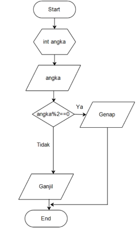
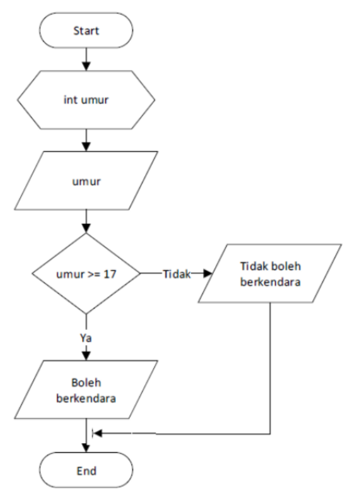

<div style="text-align: center;">
    <h1>Jobsheet 4</h1>
    <h4>Pemilihan 1</h4>
</div>

## Identitas Mahasiswa

> Nama : Aji Hamdani Ahmad <br/>
> Kelas : 1B <br/>
> Prodi : D-IV Teknik Informatika <br/>
> Jurusan : Teknologi Informasi <br/>

## 1. Tujuan

Mahasiswa mampu menyelesaikan permasalahan/studi kasus menggunakan sintaks
pemilihan 1 dan mengimplemantasikannya dalam bahasa pemrogaman java.

## 2. Praktikum

### Percobaan 1

1. Perhatikan flowchart dibawah ini

   

   Flowchart diatas digunakan untuk menentukan bilangan ganjil/genap, selanjutnya kita
   akan membuat programnya berdasarkan flowchart di atas!

2. Buka text editor kemudian simpan dengan nama `PemilihanPercobaan1NoAbsen.java`
3. Buatlah struktur dasar java (membuat class dan program main).
   ```java
   public class PemilihanPercobaan103 {
    public static void main(String[] args) {
        // kode program
    }
   }
   ```
4. Tambahkan import library Scanner.
   ```java
   import java.util.Scanner;
   ```
5. Deklarasikan Scanner:
   ```java
   Scanner input = new Scanner(System.in);
   ```
6. Buatlah variabel bertipe int dengan nama bil

   ```java
   import java.util.Scanner;

   public class PemilihanPercobaan103 {
    public static void main(String[] args) {
        Scanner input = new Scanner(System.in);
        int bil;
    }
   }
   ```

7. Tambahkan kode berikut ini untuk menerima inputan dari keyboard:

   ```java
   import java.util.Scanner;

   public class PemilihanPercobaan103 {
       public static void main(String[] args) {
           Scanner input = new Scanner(System.in);
           int bil;

           System.out.print("Masukkan sebuah Bilangan: ");
           bil = input.nextInt();
       }
   }
   ```

8. Buatlah struktur kondisi untuk mengecek apakah bilangan tersebut merupakan bilangan
   genap atau ganjil

   ```java
   import java.util.Scanner;

   public class PemilihanPercobaan103 {
    public static void main(String[] args) {
        Scanner input = new Scanner(System.in);
        int bil;

        System.out.print("Masukkan sebuah Bilangan: ");
        bil = input.nextInt();

        if (bil % 2 == 0) {
            System.out.println("Bilangan Genap");
        } else {
            System.out.println("Bilangan Ganjil");
        }
    }
   }
   ```

9. Jalankan program, maka outputnya adalah sebagai berikut:

   ```
   Masukkan sebuah Bilangan: 2
   Bilangan Genap
   ```

### Pertanyaan

1.  Modifikasi program diatas dibagian struktur pemilihannya sehingga menjadi sebagai
    berikut:

        ```java
        String output = (bil % 2 == 0) ? "Bilangan Genap" : "Bilangan Ganjil";
        System.out.println(output);
        ```

2.  Jalankan dan Amati Hasilnya!
3.  Jelaskan mengapa output program yang dimodifikasi sama dengan output program
    sebelum dimodifikasi!

### Jawaban

1.  ```java
    import java.util.Scanner;

    public class PemilihanPercobaan103 {
        public static void main(String[] args) {
            Scanner input = new Scanner(System.in);
            int bil;

            System.out.print("Masukkan sebuah Bilangan: ");
            bil = input.nextInt();

            String output = (bil % 2 == 0) ? "Bilangan Genap" : "Bilangan Ganjil";
            System.out.println(output);
        }

    }

    ```

2.  `Hasil compile`

    ```
    Masukkan sebuah Bilangan: 2
    Bilangan Genap
    ```

3.  Program tersebut menghasilkan keluaran yang sama karena pada modifikasi tetap menggunakan pemilihan namun dalam model ternary dimana fungsi dari pemilihan tersebut tetap sama tetapi gaya penulisan dipersingkat menjadi satu baris kode saja.

### Percobaan 2

1. Buka text editor simpan file dengan nama `PemilihanPercobaan2NoAbsen.java`
2. Buatlah struktur dasar java (membuat class dan program main)
   ```java
   public class PemilihanPercobaan203 {
    public static void main(String[] args) {
        // kode program
    }
   }
   ```
3. Tambahakan library Scanner.
   ```java
   import java.util.Scanner;
   ```
4. Buatlah deklarasi Scanner.
   ```java
   Scanner input = new Scanner(System.in);
   ```
5. Buat variabel nilai bertipe int.

   ```java
   import java.util.Scanner;

   public class PemilihanPercobaan203 {
    public static void main(String[] args) {
        Scanner input = new Scanner(System.in);
        int nilai;
    }
   }
   ```

6. Tuliskan perintah untuk memasukkan inputan.

   ```java
   import java.util.Scanner;

   public class PemilihanPercobaan203 {
    public static void main(String[] args) {
        Scanner input = new Scanner(System.in);
        int nilai;

        System.out.print("Masukkan sebuah Bilangan: ");
        nilai = input.nextInt();
    }
   }
   ```

7. Tambahkan kode program kondisi dibawah ini

   ```java
   import java.util.Scanner;

   public class PemilihanPercobaan203 {
    public static void main(String[] args) {
        Scanner input = new Scanner(System.in);
        int nilai;

        System.out.print("Masukkan sebuah Bilangan: ");
        nilai = input.nextInt();

        if (nilai >= 100) {
            nilai += 10;
        } else {
            nilai -= 10;
        }

        System.out.println("Hasil Nilai Akhir adalah " + nilai);
    }
   }
   ```

8. Jalankan program. Amati apa yang terjadi!
   ```
   Masukkan sebuah Bilangan: 100
   Hasil Nilai Akhir adalah 110
   ```

### Pertanyaan

1. Jelaskan fungsi kode program berikut:

   > nilai+=10; <br/>
   > nilai-=10;

2. Modifikasilah program diatas dimana inputannya yang awalnya hanya satu kemudian
   diganti 2 inputan (misal : nilai1 dan nilai2), lakukan perhitungan rata-rata kedua nilai
   tersebut jika nilainya lebih dari sama dengan 100 maka dikurangi 5, sedangkan jika
   nilai rata-rata tersebut kurang dari 100 maka akan langsung dicetak!

### Jawaban

1. fungsi kode tersebut hanya menggantikan ekspresi seperti `nilai = nilai + 10` atau `nilai = nilai - 10` jadi seperti hanya sebuah shorthand yang dapat mempersingkat gaya penulisan code.

2. ```java
    public class PemilihanPercobaan203 {
       public static void main(String[] args) {
           int nilai1, nilai2, average;
           Scanner input = new Scanner(System.in);

           System.out.print("Masukkan Nilai 1: ");
           nilai1 = input.nextInt();
           System.out.print("Masukkan Nilai 2: ");
           nilai2 = input.nextInt();

           average = (nilai1 + nilai2) / 2;

           if (average >= 100) {
               average -= 5;
           } else {
               System.out.println(average);
           }

           System.out.println("Hasil Nilai Akhir adalah " + average);

           input.close();
       }
   }
   ```

   `Hasil compile`

   ```
   Masukkan Nilai 1: 90
   Masukkan Nilai 2: 100
   95
   Hasil Nilai Akhir adalah 95
   ```

### Percobaan 3

1. Buka text editor simpan file dengan nama `PemilihanPercobaan3NoAbsen.java`
2. Buatlah struktur dasar java (membuat class dan program main)
   ```java
   public class PemilihanPercobaan303 {
    public static void main(String[] args) {
        // kode program
    }
   }
   ```
3. Tambahakan library Scanner.
   ```java
   import java.util.Scanner;
   ```
4. Buatlah deklarasi Scanner.
   ```java
   Scanner input = new Scanner(System.in);
   ```
5. Buat variabel umur bertipe int.

   ```java
   import java.util.Scanner;

   public class PemilihanPercobaan303 {
    public static void main(String[] args) {
        Scanner input = new Scanner(System.in);
        int umur;
    }
   }
   ```

6. Tuliskan perintah untuk memasukkan inputan.

   ```java
   import java.util.Scanner;

   public class PemilihanPercobaan303 {
       public static void main(String[] args) {
           Scanner input = new Scanner(System.in);
           int umur;

           System.out.print("Masukkan umur Anda: ");
           umur = input.nextInt();
       }
   }
   ```

7. Tambahkan kode program kondisi dibawah ini

   ```java
   import java.util.Scanner;

   public class PemilihanPercobaan303 {
      public static void main(String[] args) {
          Scanner input = new Scanner(System.in);
          int umur;

          System.out.print("Masukkan umur Anda: ");
          umur = input.nextInt();

          if (umur > 60) {
            System.out.println("Lansia");
          } else if (umur > 45) {
            System.out.println("Tua");
          } else if (umur > 17) {
            System.out.println("Dewasa");
          } else if (umur > 5) {
            System.out.println("Anak-anak");
          } else {
            System.out.println("Balita");
        }
      }
   }
   ```

8. Jalankan program. Amati apa yang terjadi!

   ```
   Masukkan umur Anda: 18
   Dewasa
   ```

### Pertanyaan

1. Berapa jumlah kondisi yang ada pada program di percobaan 3? Jelaskan!
2. Modifikasi program diatas sehingga jika umur yang dimasukkan 0 tahun atau kurang
   dari 0 akan tampil output “Maaf umur yang anda masukkan salah”!

### Jawaban

1. Pada program tersebut terdapat 4 kondisi antara lain:

   ```
   umur > 60 menampilkan Lansia
   umur > 45 menampilkan Tua
   umur > 17 menampilkan Dewasa
   umur > 5 menampilkan Anak-anak
   ```

   Selain itu akan menampilkan `Balita`

2. ```java
      if (umur > 60) {
           System.out.println("Lansia");
       } else if (umur > 45) {
           System.out.println("Tua");
       } else if (umur > 17) {
           System.out.println("Dewasa");
       } else if (umur > 5) {
           System.out.println("Anak-anak");
       } else if (umur > 0) {
           System.out.println("Balita");
       } else {
           System.out.println("Maaf umur yang Anda masukkan salah!")
       }
   ```
   `Hasil compile`
   ```
   Masukkan umur Anda: -1
   Maaf umur yang Anda masukkan salah!
   ```

### Percobaan 4

1. Buka text editor simpan file dengan nama `PemilihanPercobaan4NoAbsen.java`
2. Buatlah struktur dasar java (membuat class dan program main)
   ```java
   public class PemilihanPercobaan403 {
       public static void main(String[] args) {
           // kode program
       }
   }
   ```
3. Buatlah deklarasi Scanner.
   ```java
    Scanner input = new Scanner(System.in);
   ```
4. Buat variabel-variabel berikut:
   ```java
   public class PemilihanPercobaan403 {
      public static void main(String[] args) {
          Scanner input = new Scanner(System.in);
          double angka1, angka2, hasil;
          char operator;
      }
   }
   ```
5. Tuliskan perintah untuk memasukkan inputan.

   ```java
   public class PemilihanPercobaan403 {
      public static void main(String[] args) {
          Scanner input = new Scanner(System.in);
          double angka1, angka2, hasil;
          char operator;

          System.out.print("Masukkan angka pertama: ");
          angka1 = input.nextDouble();
          System.out.print("Masukkan angka kedua: ");
          angka2 = input.nextDouble();
          System.out.print("Masukkan operator (+ - * /): ");
          operator = input.next().charAt(0);
      }
   }
   ```

6. Tambahkan kode program kondisi dibawah ini

   ```java
   public class PemilihanPercobaan403 {
     public static void main(String[] args) {
         Scanner input = new Scanner(System.in);
         double angka1, angka2, hasil;
         char operator;

         System.out.print("Masukkan angka pertama: ");
         angka1 = input.nextDouble();
         System.out.print("Masukkan angka kedua: ");
         angka2 = input.nextDouble();
         System.out.print("Masukkan operator (+ - * /): ");
         operator = input.next().charAt(0);

         switch(operator) {
            case '+':
                hasil = angka1 + angka2;
                System.out.println(angka1 + " + " + angka2 + " = " + hasil);
                break;
            case '-':
                hasil = angka1 - angka2;
                System.out.println(angka1 + " - " + angka2 + " = " + hasil);
                break;
            case '*':
                hasil = angka1 * angka2;
                System.out.println(angka1 + " * " + angka2 + " = " + hasil);
                break;
            case '/':
                hasil = angka1 / angka2;
                System.out.println(angka1 + " / " + angka2 + " = " + hasil);
                break;
            default:
                System.out.println("Operator yang Anda masukkan salah!");
        }
     }
   }
   ```

7. Jalankan program. Amati apa yang terjadi!

   ```
   Masukkan angka pertama: 2
   Masukkan angka kedua: 5
   Masukkan operator (+ - * /): +
   2.0 + 5.0 = 7.0
   ```

### Pertanyaan

1. Jelaskan fungsi dari break dan default pada percobaan 4 diatas!
2. Jelaskan fungsi perintah kode program dibawah ini pada percobaan 4!

### Jawaban

1. `break` sendiri dalam switch case berfungsi untuk menghentikan statement pada sebuah case sehingga ketika sudah melakukan eksekusi pada case yang tepat harus selalu dilakukan `break` sehingga tidak berhenti pada switch case. sedangkan `default` merupakan opsi terakhir yang akan dipilih jika semua case tidak ada yang tepat.

2. `operator = sc.next().charAt(0);`
   statement tersebut merupakan cara untuk mengambil input sebuah char karena cara untuk mengambil sebuah char yaitu dengan mengambil karakter dari sebuah String.

### Tugas

1. Buatlah program untuk menginputkan dua buah bilangan bulat, kemudian cetak salah satu bilangan
   yang nilainya terbesar.

```java
import java.util.Scanner;

public class Task1 {
    public static void main(String[] args) {
        Scanner input = new Scanner(System.in);
        int num1, num2, selisih1, selisih2;

        System.out.print("Masukkan nilai ke 1 \t : ");
        num1 = input.nextInt();
        System.out.print("Masukan nilai ke 2 \t : ");
        num2 = input.nextInt();

        if (num1 > num2) {
            selisih1 = num1 - num2;
            System.out.println("Nilai ke 1 lebih besar " + selisih1 + " dari pada nilai ke 2");
        } else {
            selisih2 = num2 - num1;
            System.out.println("Nilai ke 2 lebih besar " + selisih2 + " dari pada nilai ke 1");
        }

        input.close();
    }
}
```

`Hasil compile`

```
Masukkan nilai ke 1      : 5
Masukan nilai ke 2       : 4
Nilai ke 1 lebih besar 1 dari pada nilai ke 2
```

2.  Perhatikan flowchart berikut ini:

    

    Buatlah program sesuai dengan flowchart diatas!

    ```java
    public class Task2 {
        public static void main(String[] args) {
            Scanner sc = new Scanner(System.in);
            int umur;

            System.out.print("Berapakah umur Anda sekarang: ");
            umur = sc.nextInt();

            System.out.println((umur >= 17) ? "Boleh Berkendara" : "Tidak Boleh Berkendara");
            sc.close();
        }

    }
    ```

    `Hasil compile`

    ```
    Berapakah umur Anda sekarang: 19
    Boleh Berkendara
    ```

3.  Pada akhir semester seorang dosen menghitung nilai akhir dari mahasiswa yang terdiri
    dari nilai uas, uts, kuis, dan tugas. Nilai akhir didapatkan dari 40% nilai uas, 30% nilai
    uts, 10% nilai kuis, dan 20% nilai tugas. Jika nilai akhir dari mahasiswa dibawah 65 maka
    mahasiswa tersebut akan mendapatkan remidi. Buatlah program untuk membantu
    mengetahui mahasiswa yang mendapatkan remidi berdasarkan nilai akhir yang
    didapatkannya!

    ```java
    public class Task3 {
        public static void main(String[] args) {
            Scanner sc = new Scanner(System.in);

            double uas, uts, kuis, tugas, total;

            System.out.print("Masukkan nilai UAS: ");
            uas = sc.nextDouble();
            System.out.print("Masukkan nilai UTS: ");
            uts = sc.nextDouble();
            System.out.print("Masukkan nilai KUIS: ");
            kuis = sc.nextDouble();
            System.out.print("Masukkan nilai TUGAS: ");
            tugas = sc.nextDouble();

            total = (uas * 0.4) + (uts * 0.3) + (kuis * 0.1) + (tugas * 0.2);

            if (total > 100 || total < 0) {
                System.out.println("Maaf kamu melewati batas wajar nilai yang sesungguhnya :)");
            } else if (total < 65) {
                System.out.println("Nilai kamu: " + total);
                System.out.println("KAMU HARUS REMIDI!");
            } else {
                System.out.println("Nilai kamu: " + total);
                System.out.println("SELAMAT KAMU LULUS!");
            }

            sc.close();
        }
    }
    ```

    `Hasil compile`

    ```
    Masukkan nilai UAS: 100
    Masukkan nilai UTS: 90
    Masukkan nilai KUIS: 100
    Masukkan nilai TUGAS: 95
    Nilai kamu: 96.0
    SELAMAT KAMU LULUS!
    ```

4.  Sebuah toko memberikan diskon kepada pelanggannya dengan ketentuan sebagai berikut :

            | Total Belanja     | Potongan |
            | ----------------- | -------- |
            | >Rp. 200.000,00   | 2%       |
            | >Rp. 500.000,00   | 5%       |
            | >Rp. 1.000.000,00 | 10%      |

        Total belanja diperoleh dari pembelian tiga barang yaitu barang A, barang B, dan barang C. Ketika menginputkan harga barang juga menginputkan jumlah barang yang dibeli.

    ```java
    import java.util.Scanner;

    public class Task4 {
        public static void main(String[] args) {
            Scanner sc = new Scanner(System.in);

            int a, b, c;
            double priceA, priceB, priceC, discount, total;

            System.out.print("Masukkan Harga barang A: ");
            priceA = sc.nextDouble();
            System.out.print("Masukkan Jumlah barang A: ");
            a = sc.nextInt();
            System.out.print("Masukkan Harga barang B: ");
            priceB = sc.nextDouble();
            System.out.print("Masukkan Jumlah barang B: ");
            b = sc.nextInt();
            System.out.print("Masukkan Harga barang C: ");
            priceC = sc.nextDouble();
            System.out.print("Masukkan Jumlah barang C: ");
            c = sc.nextInt();

            total = ((priceA * a) + (priceB * b) + (priceC * c));

            if (total > 1000000) {
                discount = 0.1;
            } else if (total > 500000) {
                discount = 0.05;
            } else if (total > 200000) {
                discount = 0.02;
            } else {
                discount = 0;
            }

            System.out.println("-------------------------");
            System.out.println("\t Struk Nota");
            System.out.println("-------------------------");
            System.out.println("Nama Barang\t|\tHarga\t|\tJumlah\t|\tTotal");
            System.out.println("Barang A\t| " + priceA + "\t| " + a + "\t\t| " + (priceA * a));
            System.out.println("Barang A\t| " + priceB + "\t| " + b + "\t\t| " + (priceB * b));
            System.out.println("Barang A\t| " + priceC + "\t| " + c + "\t\t| " + (priceC * c));
            System.out.println("\t Total\t\t\t: " + total);
            System.out.println("\t Discount\t\t: " + (total * discount));
            System.out.println("\t Total Bayar\t\t: " + (total * (1 - discount)));

            sc.close();
        }
    }
    ```

    `Hasil compile`

    ```
    Masukkan Harga barang A: 100000
    Masukkan Jumlah barang A: 10
    Masukkan Harga barang B: 250000
    Masukkan Jumlah barang B: 5
    Masukkan Harga barang C: 150000
    Masukkan Jumlah barang C: 1

    -------------------------------
             Struk Nota
    -------------------------------

    Nama Barang | Harga | Jumlah | Total
    Barang A | 100000.0 | 10 | 1000000.0
    Barang A | 250000.0 | 5 | 1250000.0
    Barang A | 150000.0 | 1 | 150000.0
    Total : 2400000.0
    Discount : 240000.0
    Total Bayar : 2160000.0
    ```
