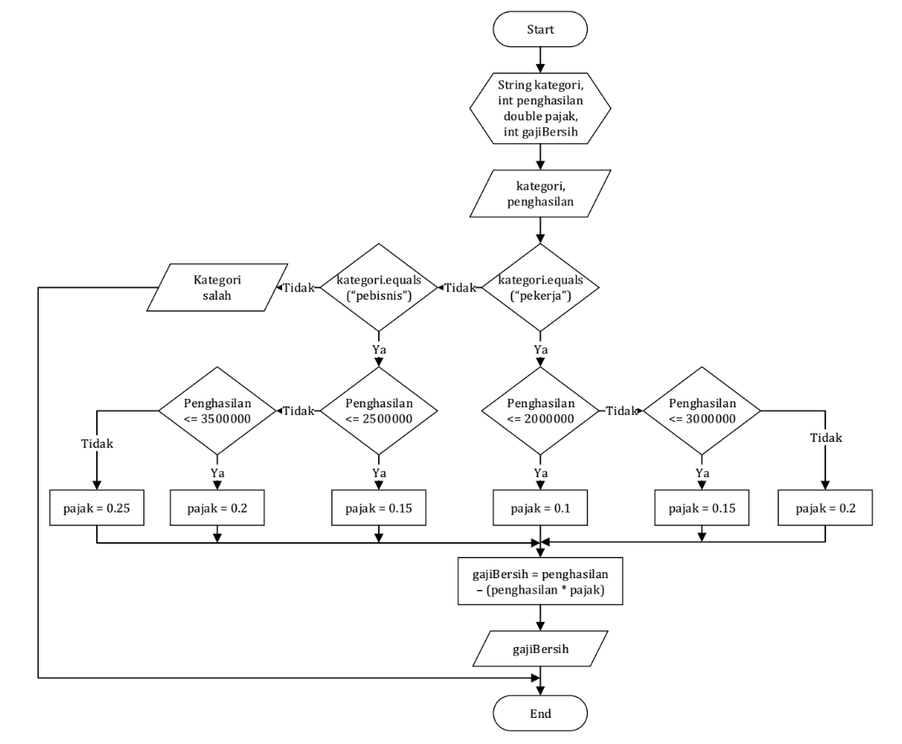
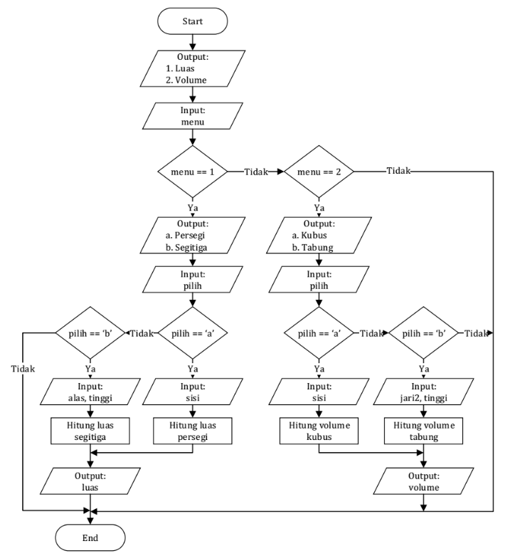

<div style="text-align: center;">
    <h1>Jobsheet 5</h1>
    <h4>Pemilihan 2</h4>
</div>

## Identitas Mahasiswa

> Nama : Aji Hamdani Ahmad <br/>
> Kelas : 1B <br/>
> Prodi : D-IV Teknik Informatika <br/>
> Jurusan : Teknologi Informasi <br/>

## 1. Tujuan

- Mahasiswa memahami tentang operator logika
- Mahasiswa mampu menyelesaikan permasalahan dengan menggunakan sintaks
  pemilihan bersarang
- Mahasiswa mampu membuat sebuah program Java yang memanfaatkan sintaks
  pemilihan bersarang

## 2. Praktikum

### Percobaan 1

1. Jalankan java Buka text editor kemudian simpan dengan nama `PercobaanNilai.java`
2. Buatlah struktur dasar java (membuat class dan program main).
   ```java
   public class PercobaanNilai {
    public static void main(String[] args) {
        // kode program
    }
   }
   ```
3. Tambahkan import library Scanner.
   ```java
   import java.util.Scanner;
   ```
4. Buatlah struktur kondisi seperti dibawah ini :

   ```java
   import java.util.Scanner;

   public class PercobaanNilai {
    public static void main(String[] args) {
        int nilai;
        String grade;
        Scanner scan = new Scanner(System.in);

        System.out.print("Masukkan nilai: ");
        nilai = scan.nextInt();

        if (nilai >= 0 && nilai <= 100) {
            if (nilai >= 90 && nilai <= 100) {
                System.out.println("NILAI A, EXCELLENT");
            } else if (nilai >= 80 && nilai <= 89) {
                System.out.println("NILAI B, Pertahankan Prestasi Anda");
            } else if (nilai >= 60 && nilai <= 79) {
                System.out.println("NILAI C, Tingkatkan Prestasi Anda");
            } else if (nilai >= 50 && nilai <= 59) {
                System.out.println("NILAI D, Tingkatkan Belajar Anda");
            } else {
                System.out.println("NILAI E, Anda tidak lulus");
            }
        } else {
            System.out.println("Nilai yang anda masukkan tidak valid");
        }
    }
   }
   ```

5. Jalankan program tersebut. Amati apa yang terjadi!

   `Hasil compile`

   ```
   Masukkan nilai: 87
   NILAI B, Pertahankan Prestasi Anda
   ```

### Pertanyaan

1. Jelaskan fungsi sintaks if (nilai >= 0 && nilai <= 100)!
2. Modifikasi kode program pada Percobaan 1 sehingga jika nilai yang dimasukkan kurang
   dari 0 akan ditampilkan output “Nilai yang Anda masukkan kurang dari 0” dan jika nilai
   yang dimasukkan lebih dari 100 akan ditampilkan output “Nilai yang Anda masukkan
   lebih dari 100”!
3. Ubah operator && menjadi || pada sintaks if (nilai >= 0 && nilai <= 100).
   Jalankan program dengan memasukkan nilai = 105. Amati apa yang terjadi! Mengapa
   hasilnya demikian?

### Jawaban

1. Fungsi dari sintaks tersebut untuk memastikan nilai yang diinputkan oleh User dalam range antara `0 hingga 100` tidak melebihi itu namun jika lebih dari range yang telah ditentukan maka akan masuk ke dalam else dan akan mengembalikan output berupa `Nilai yang anda masukkan tidak valid`

2. ```java
   public class PercobaanNilai {
    public static void main(String[] args) {
        int nilai;
        // String grade;
        Scanner scan = new Scanner(System.in);

        System.out.print("Masukkan nilai: ");
        nilai = scan.nextInt();

        if (nilai >= 0 && nilai <= 100) {
            if (nilai >= 90 && nilai <= 100) {
                System.out.println("NILAI A, EXCELLENT");
            } else if (nilai >= 80 && nilai <= 89) {
                System.out.println("NILAI B, Pertahankan Prestasi Anda");
            } else if (nilai >= 60 && nilai <= 79) {
                System.out.println("NILAI C, Tingkatkan Prestasi Anda");
            } else if (nilai >= 50 && nilai <= 59) {
                System.out.println("NILAI D, Tingkatkan Belajar Anda");
            } else {
                System.out.println("NILAI E, Anda tidak lulus");
            }
        } else if (nilai > 100) {
            System.out.println("Nilai yang anda masukkan lebih dari 100");
        } else if (nilai < 0) {
            System.out.println("Nilai yang anda masukkan kurang dari 0");
        } else {
            System.out.println("Nilai yang anda masukkan tidak valid");
        }

        scan.close();
    }
   }
   ```

   `Hasil compile`

   ```
   Masukkan nilai: -1
   Nilai yang anda masukkan kurang dari 0
   ```

3. ```java
   if (nilai >= 0 || nilai <= 100)
   ```

   `Hasil compile`

   ```
   Masukkan nilai: 105
   NILAI E, Anda tidak lulus
   ```

   Program akan menghasilkan output `NILAI E, anda tidak lulus` karena pada block statement `(nilai >= 0 || nilai <= 100)` memenuhi salah satu statement-nya yaitu nilai >= 0 sehingga salah satu bernilai `true` dan apabila operator `OR` / `||` jika salah satu `true` maka akan `true` dan karena `105` tidak ditetapkan pada kondisi maka masuk ke dalam else yaitu menampilkan

   ```java
   System.out.println("NILAI E, Anda tidak lulus");
   ```

### Percobaan 2

1. Perhatikan flowchart berikut ini:
   

   Flowchart tersebut digunakan untuk menghitung gaji bersih seseorang setelah dipotong
   pajak sesuai dengan kategorinya (pekerja dan pebisnis) dan besarnya penghasilan.

2. Jalankan textEditor
3. Buat nama Project `PercobaanPemilihan2.java`
4. Tambahkan import library Scanner
   ```java
   import java.util.Scanner;
   ```
5. Tuliskan struktur dasar bahasa Java yang berisi fungsi main()
   ```java
   public class PercobaanPemilihan2 {
    public static void main(String[] args) {
        // kode program
    }
   }
   ```
6. Deklarasikan Scanner dengan nama scan
   ```java
   Scanner scan = new Scanner(System.in);
   ```
7. Deklarasikan variabel kategori, penghasilan, gajiBersih, dan pajak;
   ```java
   public class PercobaanPemilihan2 {
    public static void main(String[] args) {
        Scanner scan = new Scanner(System.in);
        String kategori;
        double pajak;
        int penghasilan, gajiBersih;
    }
   }
   ```
8. Tambahkan kode berikut ini untuk menerima input dari keyboard

   ```java
   public class PercobaanPemilihan2 {
    public static void main(String[] args) {
        Scanner scan = new Scanner(System.in);
        String kategori;
        double pajak;
        int penghasilan, gajiBersih;

        System.out.print("Masukkan kategori [pekerja / pebisnis]: ");
        kategori = scan.nextLine();
        System.out.print("Masukkan besarnya penghasilan: ");
        penghasilan = scan.nextInt();
    }
   }
   ```

9. Buatlah struktur pengecekan kondisi bersarang. Pengecekan pertama digunakan untuk
   mengecek kategori (pekerja atau pebisnis). Selanjutnya dilakukan pengecekan kedua
   untuk menentukan besarnya pajak berdasarkan penghasilan yang telah dimasukkan.
   Kemudian tambahkan kode program untuk menghitung gaji bersih yang diterima setelah
   dipotong pajak

   ```java
   import java.util.Scanner;

   public class PercobaanPemilihan2 {
       public static void main(String[] args) {
           String kategori;
           int penghasilan, gajiBersih;
           double pajak = 0;

           Scanner scan = new Scanner(System.in);

           System.out.print("Masukkan kategori [pekerja/pebisnis]: ");
           kategori = scan.nextLine();
           System.out.print("Masukkan besarnya penghasilan: ");
           penghasilan = scan.nextInt();

           if (kategori.equalsIgnoreCase("pekerja")) {
               if (penghasilan <= 2000000) {
                   pajak = 0.1;
               } else  if (penghasilan <= 3000000) {
                   pajak = 0.15;
               } else {
                   pajak = 0.2;
               }

               gajiBersih = (int) (penghasilan - (penghasilan * pajak));
               System.out.println("Gaji bersih yang Anda terima: " + gajiBersih);
           } else if (kategori.equalsIgnoreCase("pebisnis")) {
               if (penghasilan <= 2500000) {
                   pajak = 0.15;
               } else if (penghasilan <= 3500000) {
                   pajak = 0.2;
               } else {
                   pajak = 0.25;
               }

               gajiBersih = (int) (penghasilan - (penghasilan * pajak));
               System.out.println("Gaji bersih yang Anda terima: " + gajiBersih);
           } else {
               System.out.println("Kategori yang Anda masukkan salah!");
           }

           scan.close();
       }
   }
   ```

10. Jalankan program tersebut. Amati apa yang terjadi!

    `Hasil compile`

    ```
    Masukkan kategori: pekerja
    Masukkan besarnya penghasilan: 1750000
    Gaji bersih yang Anda terima: 1575000
    ```

### Pertanyaan

1. Jalankan program dengan memasukkan kategori = pekerja dan penghasilan = 2048485.
   Amati apa yang terjadi! Mengapa angka di belakang koma tidak ditampilkan?
2. Jelaskan fungsi dari (int) pada sintaks gajiBersih = (int) (penghasilan -
   (penghasilan \* pajak));
3. Jalankan program dengan memasukkan kategori = PEBISNIS dan penghasilan = 2000000.
   Amati apa yang terjadi! Apa kegunaan dari equalsIgnoreCase?
4. Ubah equalsIgnoreCase menjadi equals, kemudian jalankan program dengan
   memasukkan kategori = PEBISNIS dan penghasilan = 2000000. Amati apa yang terjadi!
   Mengapa hasilnya demikian? Apa kegunaan dari equals?
5. Modifikasi kode program pada Percobaan 2 sehingga jika penghasilan yang dimasukkan
   0 atau kurang dari 0, maka terdapat informasi yang menyatakan bahwa penghasilan yang
   dimasukkan tidak valid!

### Jawaban

1. `Output`

   ```
   Masukkan kategori [pekerja/pebisnis]: pekerja
   Masukkan besarnya penghasilan: 2048485
   Gaji bersih yang Anda terima: 1741212
   ```

   Karena gajiBersih dan penghasilan bertipe `Integer` maka semua angka yang ada dibelakang `,` maka akan dibulatkan

2. Karena hasil dari perkalian dengan pajak menghasilkan nilai `double` maka harus dilakukan casting nilai menjadi `Integer` agar dapat dimasukkan ke dalam variabel gajiBersih.

3. ```
   Masukkan kategori [pekerja/pebisnis]: PEBISNIS
   Masukkan besarnya penghasilan: 2000000
   Gaji bersih yang Anda terima: 1700000
   ```

   `equalsIgnoreCase` disini bertujuan untuk comparing String tanpa memperdulikan letter case baik berupa `UPPERCASE` / `kapital` akan tetap dianggap menjadi `LOWERCASE` sehingga hanya akan compare value dari `String` tersebut.

4. ```java
      else if (kategori.equals("pebisnis")) {
           if (penghasilan <= 2500000) {
               pajak = 0.15;
           } else if (penghasilan <= 3500000) {
               pajak = 0.2;
           } else {
               pajak = 0.25;
           }

           gajiBersih = (int) (penghasilan - (penghasilan * pajak));
           System.out.println("Gaji bersih yang Anda terima: " + gajiBersih);
       }
   ```

   `Hasil compile`

   ```
   Masukkan kategori [pekerja/pebisnis]: PEBISNIS
   Masukkan besarnya penghasilan: 2000000
   Kategori yang Anda masukkan salah!
   ```

   Seperti pada soal nomor 3 kegunaan dari `equalsIgnoreCase` untuk membandingkan `String` tanpa memperdulikan letter case namun ketika dirubah menjadi `equals` saja maka akan dibandingkan berdasarkan letter case juga jadi meskipun value benar namun letter case terdapat kesalahan maka akan dianggap `false`

5. ```java
      if (penghasilan > 0) {
          if (kategori.equalsIgnoreCase("pekerja")) {
              if (penghasilan <= 2000000) {
               pajak = 0.1;
              } else if (penghasilan <= 3000000) {
               pajak = 0.15;
              } else {
               pajak = 0.2;
              }

              gajiBersih = (int) (penghasilan - (penghasilan * pajak));
              System.out.println("Gaji bersih yang Anda terima: " + gajiBersih);
          } else if (kategori.equalsIgnoreCase("pebisnis")) {
              if (penghasilan <= 2500000) {
               pajak = 0.15;
              } else if (penghasilan <= 3500000) {
               pajak = 0.2;
              } else {
               pajak = 0.25;
              }

              gajiBersih = (int) (penghasilan - (penghasilan * pajak));
              System.out.println("Gaji bersih yang Anda terima: " + gajiBersih);
          } else {
              System.out.println("Kategori yang Anda masukkan salah!");
          }
      } else {
          System.out.println("Penghasilan yang Anda masukkan tidak valid!");
      }
   ```

   `Hasil compile`

   ```
   Masukkan kategori [pekerja/pebisnis]: pebisnis
   Masukkan besarnya penghasilan: 0
   Penghasilan yang Anda masukkan tidak valid!
   ```

### Tugas

1. Sistem pembelian tiket kereta api secara online pada kelas eksekutif Jakarta-Malang
   tersedia pada harga Rp 1.250.000,- pada kode keberangkatan: PG. Sedangkan pada bisnis
   maka biaya Rp 1.375.000 (kode keberangkatan: SG). Yang terakhir, kelas luxury terpatok
   pada harga Rp 2.500.000, (kode keberangkatan: MG). Pada pembelian pada setiap kelas
   dikenakan biaya administrasi sebesar Rp. 50.000,-. Buatlah sebuah program dimana
   menampilkan output :
   A. Kode keberangkatan
   B. Tipe kelas kereta yang dibeli
   C. Biaya Tiket
   D. Total Bayar beserta administrasi
   E. Selain itu masuk ke biaya regular yaitu hanya membayar Rp 50.000,

   Contoh Output :

   > Masukkan Kode Keberangkatan [pg/sg/mg/reg]: mg <br>
   > Kode Keberangkatan: mg <br>
   > Kelas Kereta: Luxury <br>
   > Biaya Tiket: 2500000 <br>
   > Total Bayar: 2550000

   ```java
   import java.util.Scanner;

    public class Task1 {
        public static void main(String[] args) {
            String code, train = "";
            double price = 0, admin = 50000, total;
            Scanner sc = new Scanner(System.in);

            System.out.println("=============================================");
            System.out.print("Masukkan kode keberangkatan [pg/sg/mg/reg]: ");
            code = sc.next();
            System.out.println("=============================================");

            switch (code) {
                case "pg":
                    train = "Eksekutif";
                    price = 1250000;
                    break;
                case "sg":
                    train = "Bisnis";
                    price = 137500;
                    break;
                case "mg":
                    train = "Luxury";
                    price = 2500000;
                    break;
                case "reg":
                    train = "Regular";
                    price = 500000;
                    break;
            }

            total = price + admin;

            System.out.println("\n============ Tiket ============");
            System.out.println("Kode Keberangkatan\t: " + code);
            System.out.println("Kelas Kereta\t\t: " + train);
            System.out.println("Biaya Tiket\t\t: " + price);
            System.out.println("Biaya Administrasi\t: " + admin);
            System.out.println("Total Bayar\t\t: " + total);
            System.out.println("===============================");

            sc.close();
        }
    }
   ```

   `Hasil compile`

   ```
   =============================================
   Masukkan kode keberangkatan [pg/sg/mg/reg]: mg
   =============================================

   ============ Tiket ============
   Kode Keberangkatan : mg
   Kelas Kereta : Luxury
   Biaya Tiket : 2500000.0
   Biaya Administrasi : 50000.0
   Total Bayar : 2550000.0
   ===============================
   ```

2. Perhatikan flowchart berikut ini:
   

   Buat program sesuai dengan flowchart tersebut!

   ```java
   import java.util.Scanner;

   public class Task2 {
       public static void main(String[] args) {
           Scanner sc = new Scanner(System.in);
           System.out.println("Masukkan menu: ");
           System.out.print("1. Luas\n2. Volume\nPilih menu [1,2]: ");
           int menu = sc.nextInt();

           if (menu == 1) {
               System.out.println("\nPilih bangun datar: ");
               System.out.print("a. Persegi\nb. Segitiga\nPilih bangun [a,b]: ");
               char bangunDatar = sc.next().charAt(0);

               switch (bangunDatar) {
                   case 'a':
                       System.out.print("\nMasukkan sisi: ");
                       int sisi = sc.nextInt();
                       System.out.println("Luas persegi adalah " + (sisi * sisi));
                       break;
                   case 'b':
                       System.out.print("\nMasukkan alas: ");
                       int alas = sc.nextInt();
                       System.out.print("Masukkan tinggi: ");
                       int tinggi = sc.nextInt();
                       System.out.println("Luas segitiga adalah " + (alas * tinggi) / 2);
                       break;
                   default:
                       System.out.println("Tidak terdapat menu yang dipilih!");
               }

           } else if (menu == 2) {
               System.out.println("\nPilih bangun ruang: ");
               System.out.print("a. Kubus\nb. Tabung\nPilih bangun [a,b]: ");
               char bangunRuang = sc.next().charAt(0);

               switch (bangunRuang) {
                   case 'a':
                       System.out.print("\nMasukkan sisi: ");
                       int sisi = sc.nextInt();
                       System.out.println("Volume kubus adalah " + (sisi * sisi * sisi));
                       break;
                   case 'b':
                       System.out.print("\nMasukkan jari jari: ");
                       int jariJari = sc.nextInt();
                       System.out.print("Masukkan tinggi: ");
                       int tinggi = sc.nextInt();
                       System.out.println("Volume tabung adalah " + (3.14 * jariJari) * tinggi);
                       break;
                   default:
                       System.out.println("Tidak tersedia menu yang dipilih");
               }
           } else {
               System.out.println("Menu tidak tersedia");
           }

           sc.close();
       }
   }
   ```

   `Hasil compile`

   ```
   Masukkan menu:
   1. Luas
   2. Volume
   Pilih menu [1,2]: 2

   Pilih bangun ruang:
   a. Kubus
   b. Tabung
   Pilih bangun [a,b]: b

   Masukkan jari jari: 7
   Masukkan tinggi: 10
   Volume tabung adalah 219.8
   ```
